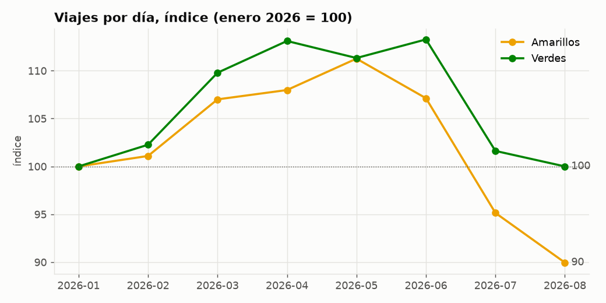
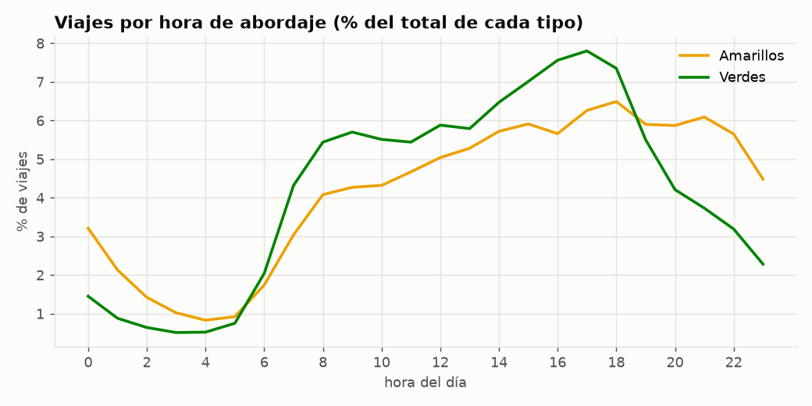
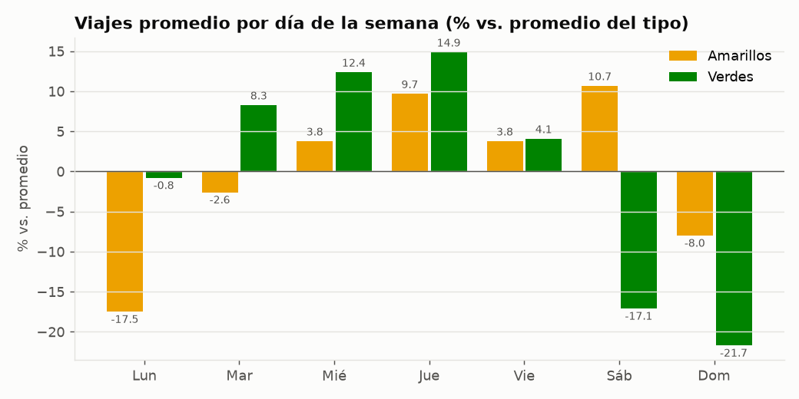
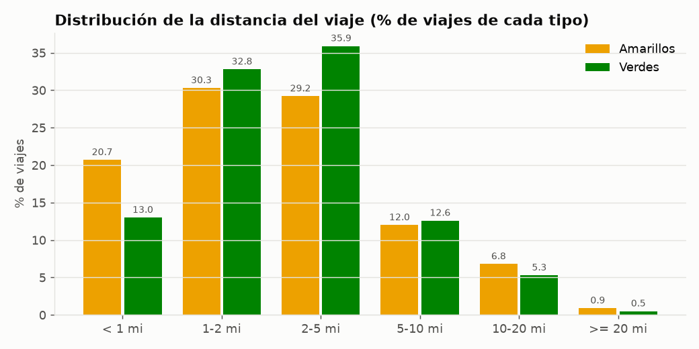
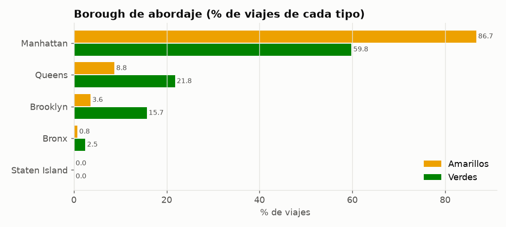
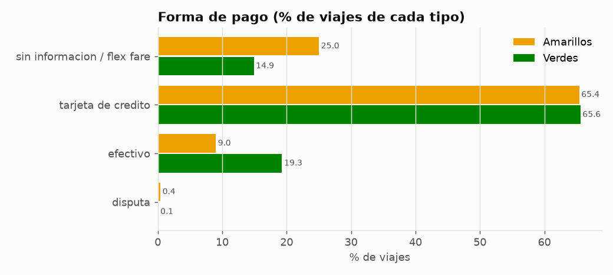
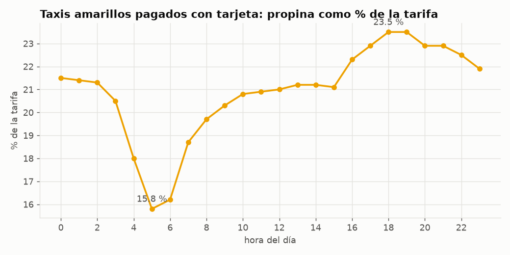

# Ejercicio 4 – Análisis exploratorio con DuckDB

| Recurso | Ruta |
|---|---|
| Consultas SQL | [`sql/ex4_analisis.sql`](../sql/ex4_analisis.sql) |
| Resultados completos (SQL + salida + tiempo) | [`docs/resultados/ex4_analisis.md`](resultados/ex4_analisis.md) |
| Notebook con gráficas | [`notebooks/ex4_analisis.ipynb`](../notebooks/ex4_analisis.ipynb) |
| Gráficas | [`docs/img/`](img/) |

Reproducir:

```bash
docker compose exec lab python scripts/download_data.py      # también descarga taxi_zone_lookup.csv
docker compose exec lab python scripts/run_sql.py sql/ex4_analisis.sql
docker compose exec lab jupyter nbconvert --to notebook --execute --inplace notebooks/ex4_analisis.ipynb
```

**Datos usados:** enero–agosto 2026, 16 archivos Parquet (`data/raw/{yellow,green}/2026/*.parquet`)
más la tabla de zonas de la TLC (`data/raw/taxi_zone_lookup.csv`, 265 zonas), todo leído
directamente desde los archivos.

## Preparación: vistas y reglas de calidad

Al inicio de `sql/ex4_analisis.sql` se definen tres vistas (no copian datos):

- **`viajes`**: une amarillos y verdes con nombres comunes (`pickup`, `dropoff`,
  `airport_fee`; los verdes no tienen `Airport_fee` y se completa con 0) y agrega
  `tipo`, `mes_archivo`, `duracion_min` y **`motivo_exclusion`**.
- **`viajes_validos`**: solo los registros con `motivo_exclusion IS NULL`, más la
  columna `velocidad_mph`.
- **`zonas`**: `read_csv` sobre la tabla de zonas.

Las reglas de exclusión salen de los problemas encontrados en el Ejercicio 3
(Q3.6c–Q3.6e). Se aplican en orden y cada registro recibe el primer motivo que cumple:

| Regla | Por qué |
|---|---|
| Fecha de abordaje fuera del mes del archivo | Q3.6c: fechas de 2001 y 2008 |
| Duración ≤ 0 o < 1 min | Q3.6d: 371 673 viajes con duración 0 y descensos antes del abordaje |
| Duración > 6 h | Q3.6d: duraciones de más de un día |
| Distancia = 0 o > 100 mi | Q3.6d/e: 952 231 con distancia 0; máximos de 328 522 mi |
| Tarifa o total negativos | Q3.6d: reversiones o reembolsos |
| Total ≥ 1 000 USD | Q3.6e: muy por encima del p99.9 (184–225 USD) |

Los registros **sin información de pago** (`payment_type = 0` o nulo, 26 % de los
amarillos) **no se excluyen**: son viajes reales con montos válidos. Se identifican
aparte en los análisis de pago y propina.

## 4.1 Preguntas planteadas y justificación

| # | Pregunta | Tema | Justificación (característica del dataset) |
|---|---|---|---|
| P1 | ¿Cómo evoluciona el volumen mensual de viajes e ingresos de cada tipo? | Temporal | Los archivos son mensuales y llegan continuamente; es la primera señal de tendencia o estacionalidad. |
| P2 | ¿En qué horas y días de la semana se concentra la demanda, y es igual en amarillos y verdes? | Temporal / tipos | Hay fecha y hora exactas de abordaje; los verdes tienen restricciones de zona que deberían notarse en el patrón de uso. |
| P3 | ¿Cómo es un viaje típico (distancia, duración, velocidad, pasajeros, tarifa)? | Características | Columnas `trip_distance`, fechas y montos; las colas largas exigen medianas. |
| P4 | ¿Cómo se distribuye la distancia y cómo varía el monto según el rango? | Distribución | Q3.6e mostró una distribución muy asimétrica (mediana 1.9 mi, máximo 328 000 mi). |
| P5 | ¿Desde dónde salen los viajes de cada tipo (borough y zona)? | Tipos | `PULocationID` + tabla de zonas. Por regulación, los verdes no pueden recoger pasajeros en el centro de Manhattan. |
| P6 | ¿Cómo pagan los pasajeros y difiere entre tipos? | Pago | `payment_type`; el 26 % sin información obliga a medir su efecto. |
| P7 | ¿Cuánta propina se deja y de qué depende (forma de pago, hora)? | Pago | `tip_amount` existe para todos los viajes, pero la propina en efectivo podría no registrarse. |
| P8 | ¿De qué se compone el monto total? | Pago | `total_amount` es la suma de 9 componentes, entre ellos recargos nuevos como `cbd_congestion_fee`. |
| P9 | ¿Qué peso tienen los viajes al aeropuerto y la cuota de congestión del CBD? | Pago / tipos | Hay zonas de aeropuerto (1, 132, 138), `Airport_fee` y `cbd_congestion_fee`. |
| P10 | ¿Cuántos registros son atípicos o inconsistentes y por qué? | Atípicos | Necesario para saber cuánto pesa la limpieza y si hay atípicos entre los viajes "válidos". |

## 4.2 – 4.4 Consultas, resultados y explicación

Cada consulta está en `sql/ex4_analisis.sql` con el identificador indicado; la salida completa
está en [`docs/resultados/ex4_analisis.md`](resultados/ex4_analisis.md).

### P1 – Volumen mensual (Q4.1)

**Consulta:** agrupa `viajes_validos` por `mes_archivo` y `tipo`; calcula viajes, viajes por
día (divide entre los días del mes para comparar meses de distinta longitud), ingresos y total
promedio.



| Mes | Amarillos/día | Verdes/día | Total prom. amarillos | Total prom. verdes |
|---|---|---|---|---|
| 2026-01 | 113 100 | 1 236 | 29.61 | 24.22 |
| 2026-05 | **125 837** (máx.) | 1 376 | 30.48 | 25.73 |
| 2026-06 | 121 161 | **1 400** (máx.) | 30.52 | 26.03 |
| 2026-08 | **101 734** (mín.) | 1 236 | 30.07 | **26.34** |

**Explicación:** los amarillos crecen de enero a mayo y caen con fuerza en verano: agosto tiene
un 19 % menos de viajes diarios que mayo y un 10 % menos que enero. Los verdes también suben en
primavera, pero en agosto vuelven exactamente al nivel de enero. El total promedio de los
amarillos se mantiene estable (~30 USD), mientras que el de los verdes sube todos los meses
(24.22 → 26.34, +8.8 %). En 8 meses los amarillos facturaron ~849 M USD y los verdes ~8.1 M USD.

### P2 – Horas y días de la semana (Q4.2, Q4.3)

**Consultas:** Q4.2 reparte los viajes de cada tipo por `hour(pickup)` como porcentaje del total
del tipo (así se comparan a pesar de la diferencia de volumen) y calcula la duración y la
velocidad medianas por hora. Q4.3 cuenta viajes por fecha, promedia por día de la semana y
expresa cada día como porcentaje respecto al promedio del tipo.




**Explicación:**

- **Hora:** los verdes concentran su demanda de día: suben bruscamente a las 7–8 h y tienen el
  pico a las 17 h (7.8 %). Después de las 19 h caen rápido. Los amarillos tienen el pico a las
  18 h (6.5 %) y se mantienen altos hasta las 22 h. A medianoche todavía hacen el 3.2 % de sus
  viajes, contra 1.5 % de los verdes.
- **Tráfico:** la velocidad mediana de los amarillos cae de 16 mph a las 5 h a **7.9 mph a las
  15 h**. Por eso un viaje a media tarde dura más (15.4 min de mediana) aunque la distancia sea
  similar.
- **Día de la semana:** patrón opuesto entre tipos. Los amarillos tienen sus días más fuertes el
  jueves y el sábado (+10 %) y el más bajo el lunes (−17.5 %). Los verdes trabajan
  principalmente entre semana (jueves +14.9 %) y caen el fin de semana (sábado −17 %,
  domingo −22 %).

### P3 – Viaje típico (Q4.4)

| | Amarillos | Verdes |
|---|---|---|
| Viajes válidos | 28 148 358 | 319 609 |
| Distancia mediana / promedio | 1.94 / 3.53 mi | 2.17 / 3.38 mi |
| Duración mediana | 14.2 min | 13.4 min |
| Velocidad mediana | 9.3 mph | 10.0 mph |
| Pasajeros promedio (% con 1) | 1.25 (82.3 %) | 1.30 (82.9 %) |
| Tarifa / total medianos | 15.60 / 23.58 USD | 13.50 / 20.52 USD |
| Tarifa por milla mediana | 7.54 USD | 6.67 USD |

**Explicación:** el viaje típico es corto (~2 millas, ~14 minutos) y de una sola persona. El
promedio de distancia casi duplica la mediana: la distribución tiene una cola larga (viajes al
aeropuerto). Los verdes recorren un poco más, más rápido y más barato por milla, lo que coincide
con que operan fuera del centro congestionado de Manhattan.

### P4 – Distribución de distancias (Q4.5)



**Explicación:** el 51 % de los viajes amarillos mide menos de 2 millas y el 20.7 % menos de
1 milla; en los verdes solo el 13 % mide menos de 1 milla y el rango más común es 2–5 mi
(35.9 %). El total mediano crece con la distancia, aunque no proporcionalmente: un viaje de menos
de 1 mi cuesta 14.75 USD (amarillo) porque los recargos fijos pesan mucho. En los viajes de
10–20 mi la diferencia entre tipos es la más grande (78.62 vs 55.50 USD), porque los amarillos
de esa distancia son sobre todo viajes al aeropuerto con tarifa fija y peajes.

### P5 – Origen de los viajes (Q4.6, Q4.7)

**Consultas:** `LEFT JOIN` de `viajes_validos` con `zonas` por `PULocationID`; porcentaje por
borough y las 10 zonas con más abordajes por tipo (`row_number()` sobre el conteo).



**Explicación:** el **86.7 %** de los viajes amarillos sale de Manhattan. Su lista de zonas
principales es Upper East Side, Midtown, Penn Station, Times Square y **JFK Airport** (3.° lugar,
3.95 %). Los verdes salen de Manhattan solo en un 59.8 %, y casi todo es el norte de la isla:
**East Harlem North y South suman el 40.2 %** de todos los viajes verdes. Queens (21.8 %) y
Brooklyn (15.7 %) pesan 2.5 y 4.4 veces más que en los amarillos. Esto es consistente con la
regla de la TLC que no permite a los taxis verdes recoger pasajeros al sur de la calle 96 Este /
110 Oeste.

### P6 – Forma de pago (Q4.8)



**Explicación:** la tarjeta domina en ambos tipos (65 %). El efectivo es el doble de frecuente en
los verdes (19.3 % contra 9.0 %). En los amarillos, el 25 % de los viajes no tiene información de
pago. Si se excluyen, la tarjeta llega al 87.2 % y el efectivo al 12 %. Sin esa corrección, la
participación de la tarjeta quedaría subestimada en más de 20 puntos.

### P7 – Propinas (Q4.9, Q4.10)

| Tipo | Forma de pago | % con propina | Propina como % de la tarifa |
|---|---|---|---|
| Amarillos | Tarjeta | 91.1 % | 21.6 % |
| Amarillos | Efectivo | 0.0 % | 0.0 % |
| Verdes | Tarjeta | 91.7 % | 21.1 % |
| Verdes | Efectivo | 0.0 % | 0.0 % |



**Explicación:** en los viajes pagados en efectivo prácticamente nunca hay propina registrada.
Eso no significa que no se deje: el taxímetro solo registra la propina cuando se paga con
tarjeta. Por eso cualquier indicador de propina debe calcularse **solo con pagos con tarjeta**.
Con tarjeta, la propina representa el 21 % de la tarifa en ambos tipos. Varía según la hora: es
mínima a las 5 h (15.8 %, cuando los viajes son más largos, en promedio 6.6 mi, y muchos van al
aeropuerto) y máxima a las 18–19 h (23.5 %).

### P8 – Composición del total (Q4.11)

| USD promedio por viaje | Amarillos | Verdes |
|---|---|---|
| Tarifa | 21.23 | 16.71 |
| Recargo de congestión (NY state) | 2.26 | 0.92 |
| Cuota CBD (congestion pricing) | 0.54 | 0.06 |
| Propina | 2.88 | 2.60 |
| Extra + MTA + improvement + aeropuerto + peajes | 3.37 | 2.62 |
| **Total** | **30.18** | **25.38** |
| Tarifa como % del total | 70.3 % | 65.8 % |

**Explicación:** cerca de un 30 % de lo que paga el pasajero no es tarifa. En los amarillos, los
dos cargos de congestión suman 2.80 USD por viaje en promedio, más que los peajes y los recargos
de aeropuerto juntos.

### P9 – Aeropuertos y cuota CBD (Q4.12)

| | Amarillos | Verdes |
|---|---|---|
| % de viajes con origen o destino en aeropuerto (JFK, LGA, EWR) | 8.10 % | 3.36 % |
| % de los ingresos de esos viajes | **20.93 %** | 6.41 % |
| Total mediano de un viaje de aeropuerto | 78.33 USD | 40.00 USD |
| % de viajes con cuota CBD | **72.51 %** | 8.57 % |
| Cuota CBD recaudada (ene–ago) | 15.31 M USD | 0.02 M USD |

**Explicación:** los viajes de aeropuerto son pocos pero muy valiosos: en los amarillos, 1 de
cada 12 viajes genera 1 de cada 5 dólares. La cuota del CBD (zona de cobro por congestión de
Manhattan al sur de la calle 60) se cobra en casi 3 de cada 4 viajes amarillos y en menos del 9 %
de los verdes, lo que confirma con datos de facturación la diferencia geográfica de P5.

### P10 – Atípicos e inconsistencias (Q4.13, Q4.14)

| Motivo de exclusión | Amarillos | Verdes |
|---|---|---|
| Distancia = 0 | 728 621 (2.45 %) | 4 628 (1.37 %) |
| Duración ≤ 0 | 371 682 (1.25 %) | 234 (0.07 %) |
| Duración < 1 min | 309 476 (1.04 %) | 11 028 (3.27 %) |
| Monto negativo | 136 567 (0.46 %) | 350 (0.10 %) |
| Duración > 6 h | 7 309 | 1 096 (0.33 %) |
| Distancia > 100 mi | 1 194 | 71 |
| Fecha fuera del mes | 146 | 98 |
| Total ≥ 1 000 USD | 2 | 0 |
| **Válidos** | **28 148 358 (94.76 %)** | **319 609 (94.81 %)** |

Entre los viajes válidos, la regla IQR sobre la tarifa por milla (Q4.14) marca como atípicos
el 5.6 % de los amarillos (> 16.19 USD/mi) y el 4.5 % de los verdes (> 12.36 USD/mi). Hay
además 4 233 viajes amarillos con velocidad promedio mayor a 80 mph, 12 522 con tarifa 0 y
119 499 con tarifa negociada (`RatecodeID = 5`).

**Explicación:** la limpieza elimina ~5 % de los registros en ambos tipos, pero por motivos
distintos. En los amarillos domina la distancia 0 y la duración 0, típico de viajes cancelados o
de taxímetros que no registran el GPS. En los verdes domina la duración menor a 1 minuto. Los
atípicos de tarifa por milla **no** se eliminan: son sobre todo viajes muy cortos donde la tarifa
mínima y los recargos fijos inflan el costo por milla, o tarifas negociadas. Son valores reales,
no errores. Los viajes a más de 80 mph sí indican errores de GPS o del reloj del taxímetro y
deberían filtrarse en análisis de velocidad.

## 4.5 Hallazgos relevantes

1. **Amarillos y verdes atienden mercados distintos, no son el mismo servicio con dos colores.**
   El 86.7 % de los amarillos sale de Manhattan (JFK es su 3.ª zona). Los verdes salen en un
   40 % de East Harlem y en un 37.5 % de Queens y Brooklyn. Los verdes son un servicio de día
   y entre semana (fin de semana −17 % / −22 %). Los amarillos tienen sus días más fuertes el
   sábado y el jueves, y mucha demanda nocturna. La cuota CBD (72.5 % vs 8.6 % de los viajes)
   confirma la separación geográfica con datos de cobro.

2. **La propina solo existe en los datos cuando se paga con tarjeta.** El 0 % de los pagos en
   efectivo registra propina, contra el 91 % de los pagos con tarjeta (21 % de la tarifa).
   Además, el 25 % de los viajes amarillos no tiene forma de pago registrada. Un promedio
   ingenuo de `tip_amount` sobre todos los viajes subestimaría la propina real y mezclaría
   efectos de registro con comportamiento del pasajero.

3. **Caída de verano en los amarillos, no en los verdes.** Entre mayo y agosto los viajes
   diarios de amarillos caen un 19 % (125 837 → 101 734). Los verdes regresan al nivel de enero
   y su ticket promedio sube todos los meses (+8.8 %). Para saber si la caída es estacional
   o una tendencia hacen falta los años anteriores (Ejercicios 5 y 8).

4. **Los viajes de aeropuerto sostienen una parte desproporcionada del ingreso:** el 8.1 % de
   los viajes amarillos genera el 20.9 % de sus ingresos, con un total mediano de 78 USD.

5. **La congestión se ve directamente en los datos:** la velocidad mediana de los amarillos
   baja de 16 mph de madrugada a 7.9 mph a las 15 h, y cerca del 30 % de lo que paga el
   pasajero corresponde a recargos y cuotas, no a la tarifa.

6. **~5 % de los registros no son viajes utilizables** (distancia 0, duración 0 o menor a un
   minuto, montos negativos). Por eso todas las consultas trabajan sobre `viajes_validos` y
   usan medianas.
