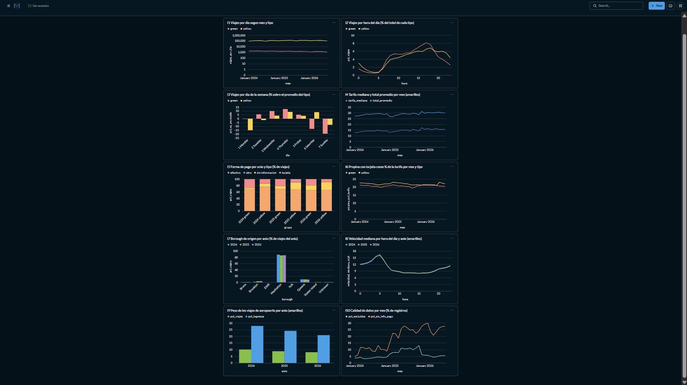

# Ejercicio 7 – Indicadores y tablero

| Recurso | Ruta |
|---|---|
| Consultas de los indicadores | [`sql/ex7_indicadores.sql`](../sql/ex7_indicadores.sql) |
| Resultados (2024 y 2026) | [`docs/resultados/ex7_indicadores.md`](resultados/ex7_indicadores.md) |
| Script que crea el tablero en Metabase | [`scripts/metabase_tablero.py`](../scripts/metabase_tablero.py) |
| Evidencia del tablero | [`docs/img/tablero_metabase.png`](img/tablero_metabase.png) |

Reproducir:

```bash
docker compose exec lab python scripts/construir_db.py
docker compose exec lab python scripts/run_sql.py sql/ex7_indicadores.sql --db data/processed/taxis.duckdb
docker compose exec lab python scripts/metabase_tablero.py
```

Los indicadores se calculan sobre la base materializada `data/processed/taxis.duckdb`
(Ejercicio 6), que Metabase abre en modo de solo lectura. El script de Metabase crea el
usuario administrador (si Metabase es nuevo), registra la base, crea una pregunta SQL por
cada bloque de `sql/ex7_indicadores.sql` y las organiza en el tablero "Taxis NYC -
Indicadores" (http://127.0.0.1:3000, usuario admin@lab8.local, contraseña lab8-duckdb-2026,
solo para el ambiente local). Las preguntas de Metabase usan exactamente el mismo SQL del
archivo, así que lo que se ve en el tablero coincide con `docs/resultados/ex7_indicadores.md`.

Este ejercicio se hizo con 2024 y 2026. En el Ejercicio 8 se reconstruye la base con 2025 y
el tablero se actualiza sin cambiar ninguna consulta.

## 7.1 y 7.2 Preguntas e indicadores

| # | Pregunta | Indicador | Gráfico |
|---|---|---|---|
| 1 | ¿Cómo cambia la demanda diaria a lo largo de los meses y entre tipos de taxi? | I1 Viajes por día según mes y tipo | Línea, escala logarítmica |
| 2 | ¿En qué horas del día se concentra la demanda? | I2 % de viajes por hora | Línea |
| 3 | ¿Qué días de la semana tienen más o menos viajes? | I3 % sobre el promedio diario del tipo | Barras |
| 4 | ¿Cómo evoluciona el precio de un viaje típico? | I4 Tarifa mediana y total promedio por mes | Línea |
| 5 | ¿Cómo pagan los pasajeros y cambia entre años? | I5 % de viajes por forma de pago | Barras apiladas |
| 6 | ¿Cuánta propina dejan quienes pagan con tarjeta? | I6 Propina como % de la tarifa | Línea |
| 7 | ¿Desde qué borough salen los viajes? | I7 % de viajes por borough de origen | Barras |
| 8 | ¿Cómo cambia la velocidad del tráfico según la hora? | I8 Velocidad mediana por hora | Línea |
| 9 | ¿Qué peso tienen los viajes de aeropuerto? | I9 % de viajes y de ingresos de aeropuerto | Barras |
| 10 | ¿Qué tan confiables son los datos de cada mes? | I10 % de registros excluidos y sin información de pago | Línea |

## 7.6 Justificación de los indicadores

- I1: es la medida básica de actividad. Se usa viajes por día y no viajes por mes para que los meses de distinto largo sean comparables. La escala logarítmica permite ver amarillos y verdes juntos aunque los amarillos tengan unas 70 veces más viajes.
- I2 e I3: la demanda depende de la hora y del día, y es lo que necesita quien planifica la flota. Se expresan en porcentaje para comparar los dos tipos con volúmenes muy distintos.
- I4: la tarifa mediana no se ve afectada por los viajes extremos y el total promedio incluye recargos y propinas, así que juntos muestran si sube la tarifa base o los cargos adicionales.
- I5: en el Ejercicio 3 se vio que muchos registros no tienen forma de pago; este indicador mide ese problema junto con la proporción de tarjeta y efectivo.
- I6: solo se usa tarjeta porque la propina en efectivo casi nunca se registra (Ejercicio 4).
- I7: muestra la cobertura geográfica del servicio y si los viajes salen de Manhattan hacia otros boroughs.
- I8: la velocidad mediana es una medida indirecta de la congestión, relevante desde que en 2025 empezó el cobro por congestión.
- I9: los viajes de aeropuerto son pocos pero muy caros, así que pesan mucho en los ingresos.
- I10: antes de interpretar cualquier otro indicador hay que saber si la calidad de los datos cambia en el tiempo.

## 7.3 y 7.7 Consultas

Todas están en [`sql/ex7_indicadores.sql`](../sql/ex7_indicadores.sql). Usan la vista
`viajes_validos` (viajes que pasan las reglas de calidad del Ejercicio 4), salvo I10, que usa
la tabla `viajes` completa para poder contar los registros excluidos. Ninguna consulta fija el
año: todas agrupan por mes o por año.

| Indicador | Tabla | Agrupación | Cálculo principal |
|---|---|---|---|
| I1 | viajes_validos | mes, tipo | count(*) / días distintos del mes |
| I2 | viajes_validos | hora, tipo | % del total del tipo con una ventana `OVER (PARTITION BY tipo)` |
| I3 | viajes_validos | día de la semana, tipo | promedio diario comparado con el promedio del tipo |
| I4 | viajes_validos (amarillos) | mes | median(fare_amount), avg(total_amount) |
| I5 | viajes_validos | año, tipo, forma de pago | % de viajes dentro de cada año y tipo |
| I6 | viajes_validos (tarjeta, tarifa > 0) | mes, tipo | sum(tip_amount) / sum(fare_amount) |
| I7 | viajes_validos + zonas | borough, año | % de viajes del año |
| I8 | viajes_validos (amarillos) | hora, año | median(velocidad_mph) |
| I9 | viajes_validos (amarillos) | año | % de viajes e ingresos con origen o destino en JFK, LaGuardia o Newark |
| I10 | viajes | mes | % con motivo de exclusión y % con payment_type 0 o nulo |

## 7.4 y 7.5 Tablero

El tablero tiene las 10 preguntas en una cuadrícula de dos columnas, ordenadas de demanda
(I1 a I3) a precio y pago (I4 a I6), geografía y tráfico (I7 a I9) y calidad (I10). Así se
puede comparar, por ejemplo, la caída de pagos con tarjeta de I5 con el aumento de registros
sin información de I10.

La captura muestra la versión final del tablero, ya con 2024, 2025 y 2026 (Ejercicio 8).



## 7.8 Interpretación (2024 y 2026)

I1. Los amarillos pasaron de 92 000 a 118 000 viajes diarios en 2024 a entre 101 000 y 126 000 en 2026, con el máximo en mayo de 2026. En los dos años los meses más bajos son enero y los de verano (julio y agosto). Los verdes bajaron de unos 1 700 viajes diarios en 2024 a unos 1 300 en 2026.

I2. Los dos tipos tienen su mínimo entre las 4 y las 5 de la mañana. Los verdes tienen su pico a las 17 h (8.1 % de sus viajes) y caen rápido en la noche; los amarillos tienen el pico a las 18 h (6.9 %) y siguen arriba del 5.5 % hasta las 22 h.

I3. Para los verdes los días hábiles están sobre el promedio (jueves +13 %) y el fin de semana muy por debajo (domingo −20 %). Para los amarillos el lunes es el día más bajo (−15.6 %) y el sábado está 8.3 % arriba del promedio. Los verdes se usan más para ir al trabajo y los amarillos también para salidas de fin de semana.

I4. La tarifa mediana de los amarillos subió de 12.80 USD en enero de 2024 a 14.20 a mediados de 2024 y a entre 15.60 y 16.30 en 2026. El total promedio pasó de 27.30 a cerca de 30 USD, un aumento menor en proporción que el de la tarifa.

I5. En amarillos el pago con tarjeta bajó de 76.1 % a 65.4 % y el efectivo de 13.2 % a 9.0 %, pero los viajes sin información de pago subieron de 9.3 % a 25.0 %. La caída de la tarjeta se explica sobre todo por registros sin información y no necesariamente por un cambio en la forma de pagar. En verdes pasa lo mismo (sin información de 3.8 % a 14.9 %).

I6. La propina con tarjeta se mantiene entre 20 % y 23 % de la tarifa en todo el período. En los amarillos bajó a 21.1 % a inicios de 2026 y subió a 23.1 % en junio de 2026.

I7. Manhattan concentra la gran mayoría de los viajes (88.5 % en 2024 y 86.4 % en 2026). Brooklyn pasó de 1.6 % a 3.7 % y el Bronx de 0.3 % a 0.8 %, así que hay algo más de actividad fuera de Manhattan.

I8. La velocidad mediana va de 16.5 mph a las 5 de la mañana a cerca de 8 mph entre las 11 y las 17 h. En 2026 la velocidad es casi igual a 2024, apenas 0.1 a 0.3 mph menor en la mayoría de horas.

I9. Los viajes de aeropuerto son 10.1 % de los viajes amarillos y 27.8 % de sus ingresos en 2024, y 8.1 % y 20.9 % en 2026. Siguen siendo muy rentables, pero pesan menos que antes.

I10. En 2024 se excluyó entre 3.2 % y 4.5 % de los registros cada mes, y en 2026 entre 4.4 % y 5.9 %. Los registros sin información de pago pasaron de entre 5 % y 13 % en 2024 a entre 21 % y 30 % en 2026.

Hallazgos principales:

1. La demanda de amarillos creció entre 2024 y 2026 mientras la de verdes bajó cerca de 22 % (enero a agosto, Ejercicio 5), con la misma estacionalidad en ambos años.
2. El precio típico de un viaje amarillo subió de forma sostenida (tarifa mediana de 12.80 USD en enero de 2024 a 15.60 USD o más en 2026), mientras la propina como porcentaje se mantuvo estable.
3. La calidad de los datos empeoró en 2026: la cuarta parte de los viajes amarillos no tiene forma de pago, lo que obliga a interpretar con cuidado cualquier indicador de pago.
